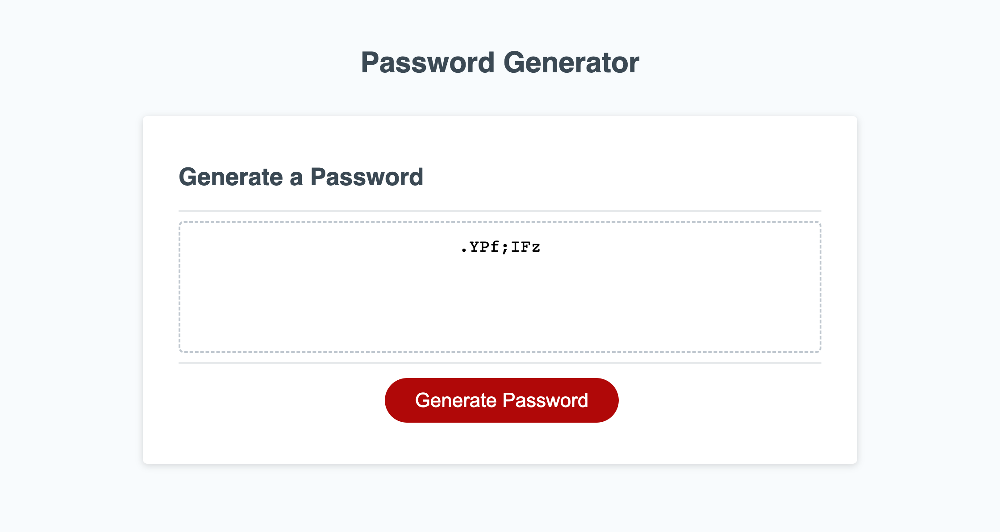

# pw-scramblejam

## Installation

Cloned starter code from ["The Coding Bootcamp"](https://github.com/coding-boot-camp/friendly-parakeet) 
provided in Module 3

## Description

1. The starter code had initial comments of where we needed to work from. From the comments provided, I made steps & combined them with the comments in order begin working on my code contribution. 

    //STEPS:

    //Get references to the #generate element

    //Take user choices and create password

    //Push user choices to own array and/or own string

    //Create password and randomize

    //Remember math.floor and math.random equation

    //returnShufflePassword

    //Write password to the #password input

    //Add event listener to generate button

2. I created all of my variables and grouped together various strings, numbers, and special characters in their corresponding array.
** (Originally, my numeric values were not housed individually in double "(s), as numbers are not considered strings. Due to a bug that arose later in my code, double "(s) were added around each number.) 

3. I added conditional expressions that followed the .prompt/.alert windows for userSelection.

4. I added an operation for randomzing all of the the userChoices and worked with message structure in alerts/prompts/confirm.

5. Over the course of my contribution to the starter code: I continued to add more conditional statements that were applicable to each individual array; I modified the message structure in the alert/prompt windows; I added concat to then merge the arrays in the conditional statements, if chosen by the user; and I added strict equalities (which proved to not be needed in most areas where first implemented).

** When I tried to run my code, I realized I didnt have a prompt for the user to add password length, as well as the windows not being proper confirm windows. This did not allow the me/user to decide which specific preferences for personalization were needed after password length. 
(It was during a class breakout session that a peer reminded me of "window.confirm" (he is referenced below). This helped me switch my prompts to confirm actions).

6. I added the prompt for the user to choose a password length between 8< || >128, and changed windows from being prompt windows to confirm windows.

7. I ran the code

** My console was blank (in devTools),and I was not able to accept all password modifications without getting: "undefined". My code would only generate a password if I disagreed to adding any modifications to the password generator. Another bug I encountered was I couldn’t go back to the original prompt if my input values were not between 8-128 characters.

8. My code was refactored to include individualized functions for each modification, (as I had been using a variable within a variable). Once this was done, the console began displaying every "click".

9. I added a call to shufflePassword, passwordLength. This function is responsible for computing the length&modifications made by the user.

10. Lastly, I closed the function, generatePassword by making a function with the variable for the returned password at the end of shufflePassword & included generatePassword.

11. Step 10 validated the eventListener for writing back the password the user wanted based off of all of their modifications.

## License
MIT

## Contributions

Tutoring from Phillip Loy

Class' Discord "Lounge" Study-Group

Assistance was received from our class TA, Shawn on various occasions in post-class breakout rooms, zoom session, and a debugging when my console would not load.

Joshua Dadbin, (class peer) assisted with code de-bugging with window.prompt to window.confirm after 3/10 GitHub merge was not generating as expected.

## Deploy Link
["https://jjjgm.github.io/pw-scramblejam/"](https://jjjgm.github.io/pw-scramblejam/)

## References
[Password Special Characters](https://owasp.org/www-community/password-special-characters)

[Stringing on Special Characters - Video](https://youtu.be/PRmTHiwTvts)

[Generate element"](https://developer.mozilla.org/en-US/docs/Web/API/Document/createElement)

[Selecting Random Items from an Array](https://css-tricks.com/snippets/javascript/select-random-item-array/)

## Assets

 
